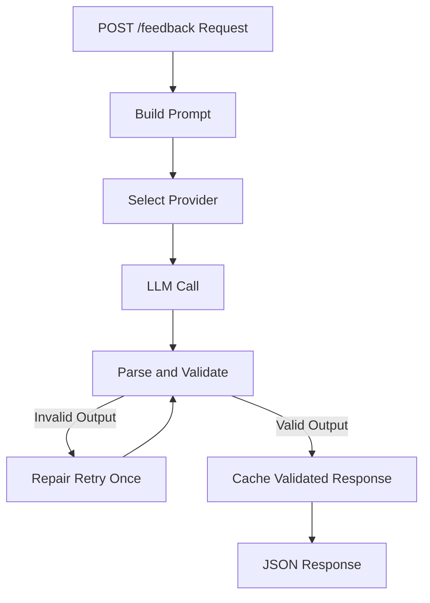
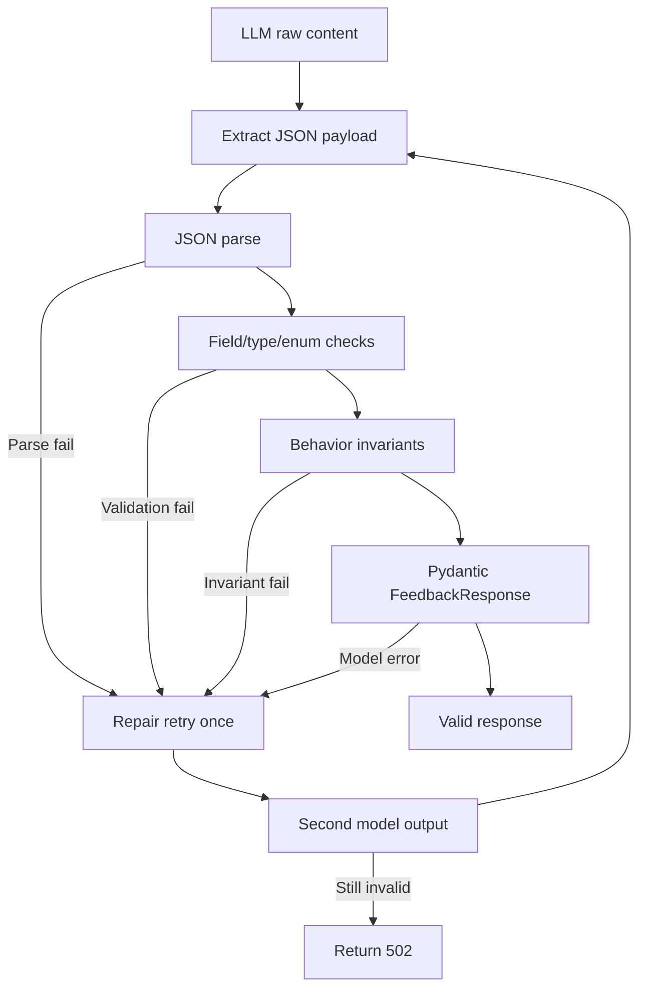

# LLM Language Feedback API

## One-Line Summary
A FastAPI microservice that analyzes learner-written sentences and returns schema-safe, multilingual correction feedback using OpenAI with Anthropic fallback.

## Overview
This service exposes `POST /feedback` for structured language feedback and `GET /health` for liveness.

The implementation is optimized for reliable structured output under real LLM variability: strict prompt constraints, defensive parsing, low-risk validation, one bounded repair retry, timeout-bounded provider calls, and cache-only-on-validated responses.

Compared with a baseline LLM endpoint, this version improves schema reliability, multilingual behavior (including non-Latin scripts), and operational predictability while staying lightweight and cost-aware.

Response shape:
- `corrected_sentence`
- `is_correct`
- `errors[]`
- `difficulty`

## Design Decisions
- **Single-pass generation + one bounded repair retry**: enough to recover common malformed output without creating latency/cost spikes from retry loops.
- **Low-risk validation + typed model construction**: defensive parse/field/enum checks followed by typed response construction keeps behavior explicit and maintainable without heavy validation machinery.
- **Same-provider repair retry**: malformed content is corrected in-place instead of cross-provider correction to keep control flow predictable and easier to debug.
- **Minimal provider abstraction**: provider routing stays simple (OpenAI primary, Anthropic fallback on call failure) to reduce code surface and operational surprises.
- **Validated in-memory cache only**: caches only known-good structured responses, improving latency/cost while keeping the service lightweight.
- **Reliability and clarity over feature breadth**: intentionally avoids extra subsystems so behavior remains easy to reason about in a small startup codebase.

## Architecture


- **POST /feedback Request**: receives learner sentence, target language, and native language.
- **Build Prompt**: composes a strict system prompt plus request-specific user payload.
- **Select Provider**: chooses OpenAI first; uses Anthropic fallback only for provider unavailability/call failure.
- **LLM Call**: executes a timeout-bounded provider request.
- **Parse and Validate**: parses JSON, enforces required fields/enums/invariants, then constructs `FeedbackResponse`.
- **Repair Retry Once**: sends one compact repair instruction when output is malformed.
- **Cache Validated Response**: stores only validated structured responses by request key.
- **JSON Response**: returns schema-conformant payload to client.

## Prompt Strategy
The prompting layer combines a strict system prompt with a request-specific user prompt and a repair instruction used only when needed.

### Prompt Skills
- **Deterministic JSON discipline**: the model is instructed to return one JSON object only.
- **Learner-safe correction behavior**: corrections are conservative and meaning-preserving.
- **User-language explanation skill**: explanations are returned in the learner's native language, reinforced both in system rules and in the dynamic user prompt (`Use {native_language} for every explanation.`).
- **Multilingual robustness**: prompt rules explicitly cover Latin and non-Latin scripts.
- **Bounded repair skill**: malformed outputs are repaired once using a focused retry instruction.

### Hard Rules (1-12)
1. **JSON only**: output must be exactly one valid JSON object (no markdown, no extra prose).
2. **Correct sentence invariant**: if input is already correct, return `is_correct=true`, `errors=[]`, and preserve the original sentence.
3. **Minimal edits**: keep learner intent, voice, and wording unless a change is required for correctness.
4. **Error object completeness**: each error must include `original`, `correction`, `error_type`, and `explanation`.
5. **Explanation language constraint**: explanation must be only in the learner's native language (never in the target language).
6. **Closed error taxonomy**: `error_type` must be one of the allowed enum values.
7. **Closed CEFR scale**: `difficulty` must be one of `A1`, `A2`, `B1`, `B2`, `C1`, `C2`.
8. **Difficulty policy**: difficulty reflects sentence complexity, not count of mistakes.
9. **Script-agnostic structure**: same response structure across Latin and non-Latin writing systems.
10. **No unnecessary rewrites**: do not alter correct phrasing/style when it is already valid.
11. **Smallest valid correction**: when alternatives exist, choose the least invasive correction and avoid introducing new vocabulary unless needed.
12. **Signal-over-style filtering**: include only issues that affect correctness or clarity; ignore minor stylistic preferences.

### Repair Prompt
If output is invalid, the service sends one compact repair instruction that restates the required schema and enum constraints, then validates again. This keeps reliability high without introducing unbounded retries.

## Reliability Design
The reliability layer prioritizes low-risk, explicit control flow:
- Defensive JSON parsing with fenced-json extraction support.
- Required-field/type/enum checks before model construction.
- Exactly one bounded repair retry for malformed output.
- Correct-sentence invariant handling (`is_correct=true`, empty errors, corrected sentence normalized to input).
- Clean failure behavior (`502` for invalid model format after retry, `503` for provider unavailability).
- Malformed content does **not** trigger provider switching; repair happens in the same provider path.

Concretely, this design targets high-frequency failure modes in LLM output: malformed JSON, enum drift, and overcorrection of already-correct sentences.



## Provider Strategy
Provider behavior is intentionally simple and explicit:
- **Primary**: OpenAI.
- **Fallback**: Anthropic.
- Fallback occurs only on provider unavailability or call failure (timeout/network/API failure path).
- Malformed model content is handled via same-provider repair retry, not cross-provider switching.

Environment behavior:
- `OPENAI_API_KEY` present: OpenAI path enabled.
- `ANTHROPIC_API_KEY` present: Anthropic path enabled.
- Both present: OpenAI first, Anthropic fallback.
- Neither present: clean `503` failure.

This keeps control flow testable and avoids abstraction overhead.

## Performance and Cost Considerations
The service uses small, practical controls to keep latency and cost predictable:
- Lightweight default model selection (`gpt-4o-mini`).
- Token-conscious prompt with compact examples.
- Cache validated responses to avoid duplicate LLM calls.
- Exactly one bounded retry (no retry storms).
- Explicit provider call timeout (`LLM_TIMEOUT_SECONDS`, default `12`).
- Avoids multi-call chains, large prompts, and repeated retries so per-request cost and latency stay predictable.

These choices improve production feasibility without introducing operational complexity.

## Testing Strategy
Testing is split by purpose:
- **Unit tests**: deterministic control-flow coverage with mocked provider outputs.
- **Integration tests**: real provider calls to validate multilingual runtime behavior.
- **Schema tests**: request/response contract checks against JSON schemas.

Validation philosophy:
- Assert behavior and contracts, not brittle exact wording.
- Cover failure paths and invariants, not only happy paths.
- Multilingual integration checks emphasize structural correctness and plausible corrections rather than exact phrasing, because valid LLM outputs can vary.

Explicitly covered edge cases:
- Correct sentences and invariant handling.
- Multiple errors in one response.
- Non-Latin scripts (Japanese, Chinese, Korean, Russian).
- Malformed model output and repair retry.
- Cache behavior and copy isolation.
- Error-type and CEFR enum enforcement.
- Provider fallback behavior.

## Tradeoffs and Non-Goals
- No RAG/embeddings: this is single-request correction, not retrieval.
- No database: service remains stateless apart from in-memory cache.
- In-memory cache only: lightweight by design, not distributed.
- No complex provider abstraction layer: simpler flow is easier to reason about and test.
- Focus is reliability and clarity over feature breadth.

## Running the Service
### Local setup
```bash
cd /home/neo/intern-task-2026
python3 -m venv .venv
source .venv/bin/activate
pip install -r requirements.txt
cp .env.example .env
# set OPENAI_API_KEY and/or ANTHROPIC_API_KEY
uvicorn app.main:app --reload
```

### Docker setup
```bash
docker compose up --build -d
curl -i http://127.0.0.1:8000/health
```

If your system uses legacy compose:
```bash
docker-compose up --build -d
curl -i http://127.0.0.1:8000/health
```

### Running tests
```bash
# local
pytest tests/test_feedback_unit.py tests/test_schema.py -v
pytest tests/test_feedback_integration.py -v

# inside compose container
docker compose exec feedback-api pytest tests/test_feedback_unit.py tests/test_schema.py -v
docker compose exec feedback-api pytest tests/test_feedback_integration.py -v
```

## Future Improvements
- Replace in-memory cache with distributed cache (e.g., Redis) for multi-instance deployments.
- Add structured evaluation harness for longitudinal prompt/provider quality tracking.
- Introduce prompt A/B tests for multilingual accuracy tuning.
- Add request-level observability (metrics, latency histograms, error taxonomy).
- Extend fallback policy with health-based provider routing and circuit-breaker behavior.

---

Authored by Akbar Aman
