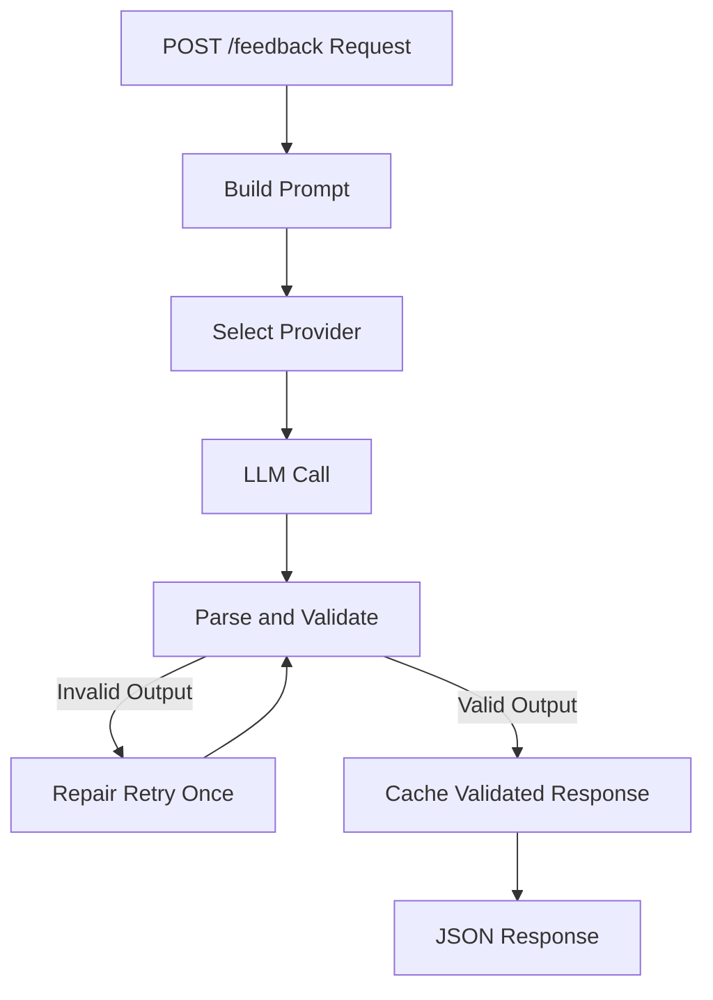
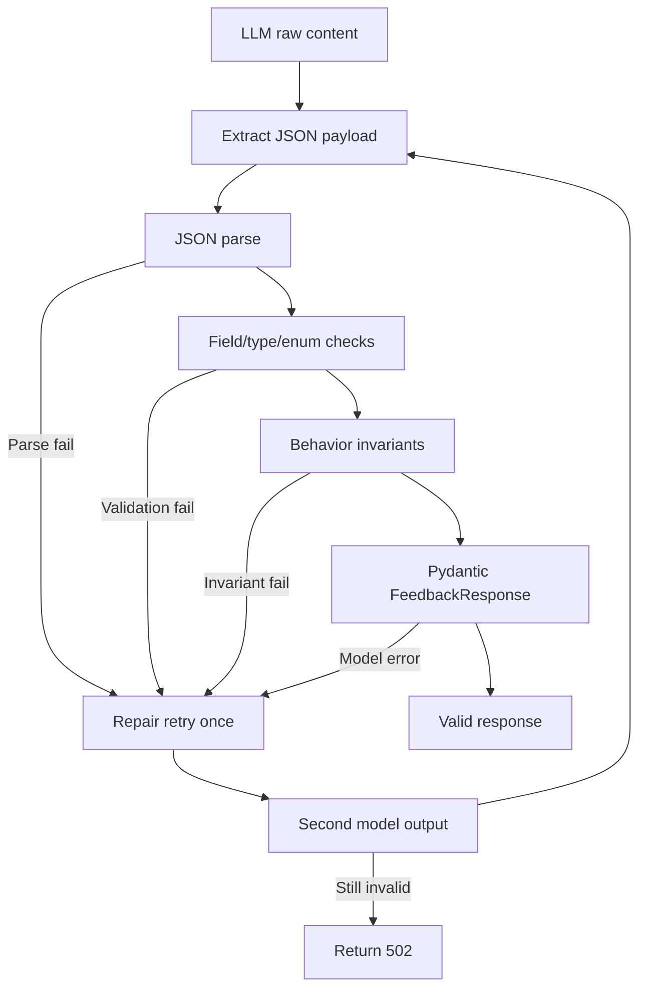

# LLM Language Feedback API

**Authored by Akbar Aman**

## One-Line Summary
A FastAPI microservice that analyzes learner-written sentences and returns schema-safe, multilingual correction feedback using OpenAI with Anthropic fallback.

## Overview
This service exposes `POST /feedback` for structured language feedback and `GET /health` for liveness.

The implementation is optimized for reliable structured output under real LLM variability: strict prompt constraints, defensive parsing, low-risk validation, one bounded repair retry, timeout-bounded provider calls, and cache-only-on-validated responses.

Compared with a baseline LLM endpoint, this version improves schema reliability, multilingual behavior (including non-Latin scripts), and operational predictability while staying lightweight and cost-aware.

Response shape:
- `corrected_sentence`
- `is_correct`
- `errors[]`
- `difficulty`

## Architecture


- **POST /feedback Request**: receives learner sentence, target language, and native language.
- **Build Prompt**: composes a strict system prompt plus request-specific user payload.
- **Select Provider**: chooses OpenAI first; uses Anthropic fallback only for provider unavailability/call failure.
- **LLM Call**: executes a timeout-bounded provider request.
- **Parse and Validate**: parses JSON, enforces required fields/enums/invariants, then constructs `FeedbackResponse`.
- **Repair Retry Once**: sends one compact repair instruction when output is malformed.
- **Cache Validated Response**: stores only validated structured responses by request key.
- **JSON Response**: returns schema-conformant payload to client.

## Prompt Strategy
The prompt is designed for deterministic structure and learner-first corrections:
- **Minimal-edit policy** to preserve learner voice and intent.
- **Native-language explanations** so feedback remains understandable to the learner.
- **Strict JSON-only output requirement** to reduce parsing ambiguity.
- **Hard constraints for allowed error types and CEFR labels**.
- **Multilingual and non-Latin robustness** explicitly stated in rules.
- **Compact examples only** (incorrect + correct) to reduce ambiguity without prompt bloat.

This balances accuracy and token discipline: strong constraints, small context footprint.

## Reliability Design
The reliability layer prioritizes low-risk, explicit control flow:
- Defensive JSON parsing with fenced-json extraction support.
- Required-field/type/enum checks before model construction.
- Exactly one bounded repair retry for malformed output.
- Correct-sentence invariant handling (`is_correct=true`, empty errors, corrected sentence normalized to input).
- Clean failure behavior (`502` for invalid model format after retry, `503` for provider unavailability).
- Malformed content does **not** trigger provider switching; repair happens in the same provider path.



## Provider Strategy
Provider behavior is intentionally simple and explicit:
- **Primary**: OpenAI.
- **Fallback**: Anthropic.
- Fallback occurs only on provider unavailability or call failure (timeout/network/API failure path).
- Malformed model content is handled via same-provider repair retry, not cross-provider switching.

Environment behavior:
- `OPENAI_API_KEY` present: OpenAI path enabled.
- `ANTHROPIC_API_KEY` present: Anthropic path enabled.
- Both present: OpenAI first, Anthropic fallback.
- Neither present: clean `503` failure.

This keeps control flow testable and avoids abstraction overhead.

## Performance and Cost Considerations
The service uses small, practical controls to keep latency and cost predictable:
- Lightweight default model selection (`gpt-4o-mini`).
- Token-conscious prompt with compact examples.
- Cache validated responses to avoid duplicate LLM calls.
- Exactly one bounded retry (no retry storms).
- Explicit provider call timeout (`LLM_TIMEOUT_SECONDS`, default `12`).

These choices improve production feasibility without introducing operational complexity.

## Testing Strategy
Testing is split by purpose:
- **Unit tests**: deterministic control-flow coverage with mocked provider outputs.
- **Integration tests**: real provider calls to validate multilingual runtime behavior.
- **Schema tests**: request/response contract checks against JSON schemas.

Validation philosophy:
- Assert behavior and contracts, not brittle exact wording.
- Cover failure paths and invariants, not only happy paths.

Explicitly covered edge cases:
- Correct sentences and invariant handling.
- Multiple errors in one response.
- Non-Latin scripts (Japanese, Chinese, Korean, Russian).
- Malformed model output and repair retry.
- Cache behavior and copy isolation.
- Error-type and CEFR enum enforcement.
- Provider fallback behavior.

## Tradeoffs and Non-Goals
- No RAG/embeddings: this is single-request correction, not retrieval.
- No database: service remains stateless apart from in-memory cache.
- In-memory cache only: lightweight by design, not distributed.
- No complex provider abstraction layer: simpler flow is easier to reason about and test.
- Focus is reliability and clarity over feature breadth.

## Running the Service
### Local setup
```bash
cd /home/neo/intern-task-2026
python3 -m venv .venv
source .venv/bin/activate
pip install -r requirements.txt
cp .env.example .env
# set OPENAI_API_KEY and/or ANTHROPIC_API_KEY
uvicorn app.main:app --reload
```

### Docker setup
```bash
docker compose up --build -d
curl -i http://127.0.0.1:8000/health
```

If your system uses legacy compose:
```bash
docker-compose up --build -d
curl -i http://127.0.0.1:8000/health
```

### Running tests
```bash
# local
pytest tests/test_feedback_unit.py tests/test_schema.py -v
pytest tests/test_feedback_integration.py -v

# inside compose container
docker compose exec feedback-api pytest tests/test_feedback_unit.py tests/test_schema.py -v
docker compose exec feedback-api pytest tests/test_feedback_integration.py -v
```

## Future Improvements
- Replace in-memory cache with distributed cache (e.g., Redis) for multi-instance deployments.
- Add structured evaluation harness for longitudinal prompt/provider quality tracking.
- Introduce prompt A/B tests for multilingual accuracy tuning.
- Add request-level observability (metrics, latency histograms, error taxonomy).
- Extend fallback policy with health-based provider routing and circuit-breaker behavior.
